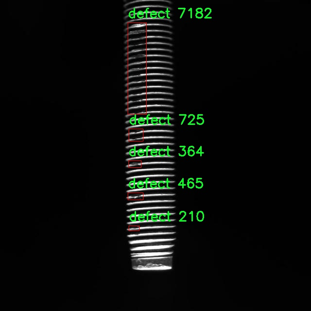

# 螺钉生产线缺陷检测检测系统源码分享
 # [一条龙教学YOLOV8标注好的数据集一键训练_70+全套改进创新点发刊_Web前端展示]

### 1.研究背景与意义

项目参考[AAAI Association for the Advancement of Artificial Intelligence](https://gitee.com/qunmasj/projects)

项目来源[AACV Association for the Advancement of Computer Vision](https://kdocs.cn/l/cszuIiCKVNis)

研究背景与意义

随着工业自动化和智能制造的快速发展，生产线的质量控制愈发受到重视。在众多制造业中，螺钉作为一种重要的紧固件，其生产过程中的质量问题直接影响到下游产品的安全性和可靠性。传统的人工检测方法不仅效率低下，而且容易受到人为因素的影响，导致漏检和误检的情况频繁发生。因此，基于计算机视觉的自动化缺陷检测系统应运而生，成为提升生产效率和质量控制的重要手段。

近年来，深度学习技术的飞速发展为图像识别和目标检测领域带来了革命性的变化。YOLO（You Only Look Once）系列模型以其高效的实时检测能力和良好的检测精度，成为了目标检测领域的热门选择。YOLOv8作为该系列的最新版本，进一步优化了模型结构和算法性能，适用于复杂场景下的物体检测任务。然而，针对特定行业的应用，尤其是螺钉生产线的缺陷检测，仍然存在一些挑战。螺钉的外观特征较为简单，缺陷类型多样且微小，如何在保证检测精度的同时提高检测速度，是实现智能化生产线的关键。

本研究旨在基于改进的YOLOv8模型，构建一个高效的螺钉生产线缺陷检测系统。为此，我们使用了包含1925张图像的数据集，这些图像均为螺钉缺陷的样本，且只包含一个类别——缺陷。这一数据集的构建为模型的训练和验证提供了坚实的基础。通过对数据集的深入分析，我们能够识别出螺钉缺陷的多样性和复杂性，进而为模型的改进提供依据。具体而言，研究将集中在数据增强、模型结构优化以及后处理算法的改进等方面，以提升YOLOv8在螺钉缺陷检测中的表现。

此外，本研究的意义不仅体现在技术层面，更在于推动智能制造的发展。通过实现高效、准确的缺陷检测系统，可以显著降低生产成本，提高生产效率，确保产品质量，从而增强企业的市场竞争力。同时，研究成果也将为其他制造领域的缺陷检测提供借鉴，促进相关技术的应用与发展。

综上所述，基于改进YOLOv8的螺钉生产线缺陷检测系统的研究，不仅具有重要的理论价值，还有着广泛的实际应用前景。通过对现有技术的改进与创新，能够为智能制造的未来发展提供新的思路和解决方案，推动制造业向更高效、更智能的方向迈进。

### 2.图片演示


##### 注意：由于此博客编辑较早，上面“2.图片演示”和“3.视频演示”展示的系统图片或者视频可能为老版本，新版本在老版本的基础上升级如下：（实际效果以升级的新版本为准）

  （1）适配了YOLOV8的“目标检测”模型和“实例分割”模型，通过加载相应的权重（.pt）文件即可自适应加载模型。

  （2）支持“图片识别”、“视频识别”、“摄像头实时识别”三种识别模式。

  （3）支持“图片识别”、“视频识别”、“摄像头实时识别”三种识别结果保存导出，解决手动导出（容易卡顿出现爆内存）存在的问题，识别完自动保存结果并导出到tempDir中。

  （4）支持Web前端系统中的标题、背景图等自定义修改，后面提供修改教程。

  另外本项目提供训练的数据集和训练教程,暂不提供权重文件（best.pt）,需要您按照教程进行训练后实现图片演示和Web前端界面演示的效果。

### 3.视频演示

[3.1 视频演示](https://www.bilibili.com/video/BV19JxTeYEch/)

### 4.数据集信息展示

##### 4.1 本项目数据集详细数据（类别数＆类别名）

nc: 1
names: ['defect']


##### 4.2 本项目数据集信息介绍

数据集信息展示

在本研究中，我们采用了名为“yolov7 all photo”的数据集，以支持对改进YOLOv8模型在螺钉生产线缺陷检测系统中的应用。该数据集专门针对螺钉生产过程中可能出现的缺陷进行了精心的标注和整理，旨在为深度学习模型提供高质量的训练数据。数据集的设计考虑到了螺钉生产线的实际情况，涵盖了各种可能的缺陷类型，尽管在本次研究中，我们主要聚焦于单一类别的缺陷检测。

数据集中包含的类别数量为1，具体类别为“defect”，这表明数据集的主要目标是识别和分类螺钉生产过程中出现的缺陷。缺陷可能包括但不限于表面划痕、裂纹、变形、锈蚀等，这些缺陷在生产过程中可能会影响螺钉的质量和性能，进而影响最终产品的可靠性。因此，准确地检测和分类这些缺陷对于提升生产效率和产品质量至关重要。

“yolov7 all photo”数据集的图像样本经过精心挑选，确保了数据的多样性和代表性。每张图像都经过专业人员的标注，标注信息不仅包括缺陷的存在与否，还可能涵盖缺陷的具体位置和类型。这种详细的标注为YOLOv8模型的训练提供了丰富的信息，使其能够更好地学习到螺钉缺陷的特征，从而提高检测的准确性和鲁棒性。

在数据集的构建过程中，考虑到了不同的拍摄角度、光照条件和背景环境，以确保模型在实际应用中能够适应各种复杂的生产环境。这种多样化的训练数据将帮助模型在面对真实世界中的螺钉缺陷时，能够做出更为准确的判断和识别。此外，数据集中的图像质量也经过严格把关，确保每张图像都具备足够的清晰度和细节，以便于模型提取有效特征。

通过使用“yolov7 all photo”数据集，我们的目标是训练出一个高效的YOLOv8模型，能够实时检测螺钉生产线上的缺陷。这一系统的成功实施将极大地提高生产线的自动化水平，减少人工检测的工作量，并且提升缺陷检测的准确性，最终为企业节省成本并提高产品质量。

总之，“yolov7 all photo”数据集为本研究提供了坚实的基础，凭借其丰富的标注信息和多样化的样本，能够有效支持YOLOv8模型的训练与优化。通过对该数据集的深入分析与应用，我们期望能够在螺钉生产线缺陷检测领域取得显著的进展，为工业自动化和智能制造贡献力量。





### 5.全套项目环境部署视频教程（零基础手把手教学）

[5.1 环境部署教程链接（零基础手把手教学）](https://www.ixigua.com/7404473917358506534?logTag=c807d0cbc21c0ef59de5)


[5.2 安装Python虚拟环境创建和依赖库安装视频教程链接（零基础手把手教学）](https://www.ixigua.com/7404474678003106304?logTag=1f1041108cd1f708b01a)

### 6.手把手YOLOV8训练视频教程（零基础小白有手就能学会）

[6.1 手把手YOLOV8训练视频教程（零基础小白有手就能学会）](https://www.ixigua.com/7404477157818401292?logTag=d31a2dfd1983c9668658)

### 7.70+种全套YOLOV8创新点代码加载调参视频教程（一键加载写好的改进模型的配置文件）

[7.1 70+种全套YOLOV8创新点代码加载调参视频教程（一键加载写好的改进模型的配置文件）](https://www.ixigua.com/7404478314661806627?logTag=29066f8288e3f4eea3a4)

### 8.70+种全套YOLOV8创新点原理讲解（非科班也可以轻松写刊发刊，V10版本正在科研待更新）

由于篇幅限制，每个创新点的具体原理讲解就不一一展开，具体见下列网址中的创新点对应子项目的技术原理博客网址【Blog】：


[8.1 70+种全套YOLOV8创新点原理讲解链接](https://gitee.com/qunmasj/good)

### 9.系统功能展示（检测对象为举例，实际内容以本项目数据集为准）

图9.1.系统支持检测结果表格显示

  图9.2.系统支持置信度和IOU阈值手动调节

  图9.3.系统支持自定义加载权重文件best.pt(需要你通过步骤5中训练获得)

  图9.4.系统支持摄像头实时识别

  图9.5.系统支持图片识别

  图9.6.系统支持视频识别

  图9.7.系统支持识别结果文件自动保存

  图9.8.系统支持Excel导出检测结果数据


### 10.原始YOLOV8算法原理

原始YOLOv8算法原理

YOLOv8算法是Ultralytics于2023年发布的最新目标检测模型，代表了YOLO系列算法的又一次重大进步。它的设计理念源于前几代YOLO模型（如YOLOv5、YOLOv6、YOLOv7和PP-YOLOE），并结合了这些模型的优势，尤其是在头部标签分配和损失函数的设计上，YOLOv8实现了更高的检测精度和速度。YOLOv8的核心在于其轻量化的网络结构和高效的特征提取机制，使其在实时检测领域达到了新的高度。

YOLOv8的网络结构主要由三个部分组成：骨干特征提取网络、特征融合网络和检测头网络。与之前的YOLO版本相比，YOLOv8在骨干特征提取网络层采用了更轻量化的C2F模块，取代了原有的C3模块。这一变化使得模型在保持高效性的同时，显著降低了计算复杂度。C2F模块通过使用3×3的卷积核和适当的深度配置，优化了特征提取的过程，增强了模型对不同尺度特征的捕捉能力。

在特征融合层，YOLOv8引入了特征金字塔网络（FPN）和路径聚合网络（PAN），这两者的结合使得多尺度特征的融合更加高效。特征金字塔网络通过自上而下的方式融合不同层次的特征，而路径聚合网络则通过自下而上的方式增强了特征的传递。这种双向的特征融合策略使得YOLOv8能够更好地处理目标在不同尺度下的表现，从而提高了检测的准确性。

值得注意的是，YOLOv8在检测头的设计上采用了Anchor-Free的检测方式，使用了解耦头结构。这一创新使得模型在进行目标检测时，不再依赖于预设的锚框，从而简化了模型的训练过程，并提高了检测的灵活性。此外，YOLOv8的损失函数采用了CloU（Class-wise Localization Uncertainty），这一损失函数的设计旨在更好地处理目标的定位不确定性，从而进一步提升了模型的性能。

YOLOv8的轻量化设计使得其在实际应用中表现出色，尤其是在资源受限的环境下。它的多个版本（如YOLOv8n、YOLOv8s、YOLOv8m等）提供了不同的计算能力和精度选择，使得用户可以根据具体需求进行选择。以YOLOv8n为例，其在保持较低计算负担的同时，依然能够实现高精度的目标检测，适合在移动设备或嵌入式系统中部署。

在应用方面，YOLOv8的高效性和准确性使其在多个领域中展现出广泛的潜力。例如，在农业领域，YOLOv8被应用于苹果采摘的自动化过程中。通过其强大的视觉识别能力，YOLOv8能够实时检测和定位苹果，帮助自动采摘机器人快速完成任务。结合蚁群算法进行路径规划，进一步提升了机器人在果园中的作业效率，使得苹果采摘变得更加智能化和高效。

总的来说，YOLOv8算法的原理在于其创新的网络结构和高效的特征处理机制。通过引入轻量化的C2F模块、双向特征融合网络以及Anchor-Free的检测方式，YOLOv8在目标检测领域实现了性能的全面提升。其广泛的应用前景和灵活的版本选择，使得YOLOv8成为了当前目标检测技术中的一颗璀璨明珠，必将对未来的研究和应用产生深远的影响。


### 11.项目核心源码讲解（再也不用担心看不懂代码逻辑）

#### 11.1 70+种YOLOv8算法改进源码大全和调试加载训练教程（非必要）\ultralytics\utils\callbacks\comet.py

以下是对给定代码的核心部分进行提炼和详细注释的结果：

```python
# Ultralytics YOLO 🚀, AGPL-3.0 license

from ultralytics.utils import LOGGER, RANK, SETTINGS, TESTS_RUNNING, ops
import os
from pathlib import Path

# 检查是否在测试环境中运行，并确保 Comet 集成已启用
try:
    assert not TESTS_RUNNING  # 确保不是在 pytest 测试中
    assert SETTINGS['comet'] is True  # 确保 Comet 集成已启用
    import comet_ml  # 导入 Comet ML 库
except (ImportError, AssertionError):
    comet_ml = None  # 如果导入失败，则将 comet_ml 设置为 None

def _get_comet_mode():
    """获取环境变量中设置的 Comet 模式，默认为 'online'。"""
    return os.getenv('COMET_MODE', 'online')

def _create_experiment(args):
    """创建 Comet 实验对象，确保在分布式训练中只在一个进程中创建。"""
    if RANK not in (-1, 0):  # 只在主进程中创建实验
        return
    try:
        comet_mode = _get_comet_mode()
        project_name = os.getenv('COMET_PROJECT_NAME', args.project)
        experiment = comet_ml.OfflineExperiment(project_name=project_name) if comet_mode == 'offline' else comet_ml.Experiment(project_name=project_name)
        experiment.log_parameters(vars(args))  # 记录参数
    except Exception as e:
        LOGGER.warning(f'WARNING ⚠️ Comet 安装但未正确初始化，未记录此运行。{e}')

def _log_images(experiment, image_paths, curr_step, annotations=None):
    """将图像及其注释记录到 Comet 实验中。"""
    if annotations:
        for image_path, annotation in zip(image_paths, annotations):
            experiment.log_image(image_path, name=image_path.stem, step=curr_step, annotations=annotation)
    else:
        for image_path in image_paths:
            experiment.log_image(image_path, name=image_path.stem, step=curr_step)

def on_train_epoch_end(trainer):
    """在训练每个 epoch 结束时记录指标和保存批次图像。"""
    experiment = comet_ml.get_global_experiment()
    if not experiment:
        return

    curr_epoch = trainer.epoch + 1  # 当前 epoch
    curr_step = curr_epoch * (len(trainer.train_loader.dataset) // trainer.batch_size)  # 当前步骤

    # 记录训练损失指标
    experiment.log_metrics(trainer.label_loss_items(trainer.tloss, prefix='train'), step=curr_step, epoch=curr_epoch)

    # 如果是第一个 epoch，记录训练批次图像
    if curr_epoch == 1:
        _log_images(experiment, trainer.save_dir.glob('train_batch*.jpg'), curr_step)

def on_train_end(trainer):
    """在训练结束时执行操作。"""
    experiment = comet_ml.get_global_experiment()
    if not experiment:
        return

    curr_epoch = trainer.epoch + 1
    curr_step = curr_epoch * (len(trainer.train_loader.dataset) // trainer.batch_size)

    # 记录模型和混淆矩阵
    experiment.log_model('YOLOv8', file_or_folder=str(trainer.best), file_name='best.pt', overwrite=True)
    experiment.log_metrics(trainer.metrics, step=curr_step, epoch=curr_epoch)
    experiment.end()  # 结束实验

# 注册回调函数
callbacks = {
    'on_train_epoch_end': on_train_epoch_end,
    'on_train_end': on_train_end
} if comet_ml else {}
```

### 代码分析和注释说明：

1. **导入模块**：导入必要的模块和库，包括 `comet_ml`，用于实验记录和监控。

2. **环境检查**：通过 `try-except` 语句确保 Comet 集成可用，并在测试环境中不记录日志。

3. **获取 Comet 模式**：`_get_comet_mode` 函数用于获取当前的 Comet 模式，默认为在线模式。

4. **创建实验**：`_create_experiment` 函数负责创建 Comet 实验对象，并记录参数。确保只在主进程中创建实验，以避免在分布式训练中重复创建。

5. **记录图像**：`_log_images` 函数用于将图像及其注释记录到 Comet 实验中。

6. **训练结束回调**：`on_train_epoch_end` 和 `on_train_end` 函数分别在每个训练 epoch 结束时和训练结束时执行，记录损失指标、模型和混淆矩阵等信息。

7. **回调注册**：最后，注册了在训练过程中需要调用的回调函数。

以上是对代码的核心部分进行了提炼和详细注释，旨在帮助理解代码的功能和结构。

这个文件是一个用于YOLOv8模型训练的回调模块，主要用于与Comet.ml进行集成，以便在训练过程中记录和可视化模型的性能和相关数据。文件的结构和功能可以分为几个部分。

首先，文件引入了一些必要的库和模块，包括`comet_ml`，用于与Comet进行交互。它还定义了一些常量和函数，用于获取环境变量中的配置，如Comet的模式、模型名称、日志记录间隔等。这些配置允许用户根据需要自定义Comet的行为。

接下来，文件定义了一些辅助函数，用于处理与Comet相关的操作。例如，`_create_experiment`函数用于创建一个Comet实验对象，并记录一些初始参数。`_fetch_trainer_metadata`函数则从训练器中提取当前的训练状态，包括当前的epoch和步骤数。

文件中还有一些函数用于处理边界框的缩放和格式化，例如`_scale_bounding_box_to_original_image_shape`和`_format_ground_truth_annotations_for_detection`。这些函数的目的是将YOLOv8模型的预测结果和真实标签格式化为Comet可以理解的格式，以便进行可视化和分析。

在训练过程中，文件定义了一些回调函数，例如`on_pretrain_routine_start`、`on_train_epoch_end`、`on_fit_epoch_end`和`on_train_end`。这些函数在训练的不同阶段被调用，负责记录训练指标、保存模型、记录混淆矩阵和图像预测等信息。

最后，文件将这些回调函数组织成一个字典`callbacks`，以便在训练过程中根据需要调用。整个模块的设计旨在提高YOLOv8模型训练的可追踪性和可视化能力，使得用户能够更好地理解模型的性能和训练过程中的变化。

#### 11.2 ui.py

```python
import sys
import subprocess

def run_script(script_path):
    """
    使用当前 Python 环境运行指定的脚本。

    Args:
        script_path (str): 要运行的脚本路径

    Returns:
        None
    """
    # 获取当前 Python 解释器的路径
    python_path = sys.executable

    # 构建运行命令，使用 streamlit 运行指定的脚本
    command = f'"{python_path}" -m streamlit run "{script_path}"'

    # 执行命令并等待其完成
    result = subprocess.run(command, shell=True)
    
    # 检查命令执行结果，如果返回码不为0，表示出错
    if result.returncode != 0:
        print("脚本运行出错。")


# 实例化并运行应用
if __name__ == "__main__":
    # 指定要运行的脚本路径
    script_path = "web.py"  # 这里可以直接指定脚本名

    # 调用函数运行脚本
    run_script(script_path)
```

### 代码注释说明：
1. **导入模块**：
   - `sys`：用于访问与 Python 解释器相关的变量和函数。
   - `subprocess`：用于执行外部命令和与其交互。

2. **定义 `run_script` 函数**：
   - 该函数接收一个参数 `script_path`，表示要运行的 Python 脚本的路径。
   - 使用 `sys.executable` 获取当前 Python 解释器的路径，以确保在正确的环境中运行脚本。
   - 构建一个命令字符串，使用 `streamlit` 模块运行指定的脚本。
   - 使用 `subprocess.run` 执行命令，并等待其完成。
   - 检查命令的返回码，如果不为0，表示脚本运行过程中出现了错误。

3. **主程序入口**：
   - 使用 `if __name__ == "__main__":` 确保该代码块仅在直接运行脚本时执行。
   - 指定要运行的脚本路径（在这里是 `web.py`）。
   - 调用 `run_script` 函数来执行指定的脚本。

这个程序文件名为 `ui.py`，其主要功能是使用当前的 Python 环境来运行一个指定的脚本，具体是一个名为 `web.py` 的文件。程序的实现依赖于几个标准库，包括 `sys`、`os` 和 `subprocess`，以及一个自定义模块 `QtFusion.path` 中的 `abs_path` 函数。

在程序开始时，首先导入了所需的模块。`sys` 模块用于访问与 Python 解释器相关的变量和函数，`os` 模块提供了与操作系统交互的功能，而 `subprocess` 模块则用于创建新进程、连接到它们的输入/输出/错误管道，并获取它们的返回码。

接下来定义了一个名为 `run_script` 的函数，该函数接受一个参数 `script_path`，表示要运行的脚本的路径。在函数内部，首先获取当前 Python 解释器的路径，使用 `sys.executable` 来实现。然后，构建一个命令字符串，格式为 `"{python_path}" -m streamlit run "{script_path}"`，这个命令将使用 Streamlit 框架来运行指定的脚本。

通过 `subprocess.run` 方法执行构建好的命令，`shell=True` 参数表示在 shell 中执行该命令。执行后，程序会检查返回码，如果返回码不为零，表示脚本运行出错，则打印出错信息。

在文件的最后部分，使用 `if __name__ == "__main__":` 语句来确保只有在直接运行该脚本时才会执行以下代码。此处调用 `abs_path` 函数来获取 `web.py` 的绝对路径，并将其赋值给 `script_path` 变量。最后，调用 `run_script` 函数来运行指定的脚本。

总体而言，这个程序的主要作用是简化在当前 Python 环境中运行 Streamlit 应用的过程，确保用户可以方便地启动一个 Web 应用。

#### 11.3 code\ultralytics\trackers\bot_sort.py

以下是经过简化和注释的核心代码部分：

```python
# 引入必要的库
from collections import deque
import numpy as np
from .basetrack import TrackState
from .byte_tracker import BYTETracker, STrack
from .utils import matching
from .utils.gmc import GMC
from .utils.kalman_filter import KalmanFilterXYWH

class BOTrack(STrack):
    """
    BOTrack类用于YOLOv8的对象跟踪，扩展了STrack类，增加了对象跟踪的功能。
    """

    # 共享的卡尔曼滤波器实例
    shared_kalman = KalmanFilterXYWH()

    def __init__(self, tlwh, score, cls, feat=None, feat_history=50):
        """初始化BOTrack对象，设置特征历史、平滑因子和当前特征。"""
        super().__init__(tlwh, score, cls)  # 调用父类构造函数

        self.smooth_feat = None  # 平滑特征
        self.curr_feat = None  # 当前特征
        if feat is not None:
            self.update_features(feat)  # 更新特征
        self.features = deque([], maxlen=feat_history)  # 存储特征的双端队列
        self.alpha = 0.9  # 平滑因子

    def update_features(self, feat):
        """更新特征向量，并使用指数移动平均进行平滑处理。"""
        feat /= np.linalg.norm(feat)  # 归一化特征
        self.curr_feat = feat  # 当前特征更新
        if self.smooth_feat is None:
            self.smooth_feat = feat  # 如果没有平滑特征，则初始化
        else:
            # 使用指数移动平均更新平滑特征
            self.smooth_feat = self.alpha * self.smooth_feat + (1 - self.alpha) * feat
        self.features.append(feat)  # 将特征添加到队列
        self.smooth_feat /= np.linalg.norm(self.smooth_feat)  # 归一化平滑特征

    def predict(self):
        """使用卡尔曼滤波器预测均值和协方差。"""
        mean_state = self.mean.copy()  # 复制当前均值状态
        if self.state != TrackState.Tracked:
            mean_state[6] = 0  # 如果状态不是跟踪状态，重置速度
            mean_state[7] = 0

        # 使用卡尔曼滤波器进行预测
        self.mean, self.covariance = self.kalman_filter.predict(mean_state, self.covariance)

    @property
    def tlwh(self):
        """获取当前边界框位置，格式为 (左上角x, 左上角y, 宽度, 高度)。"""
        if self.mean is None:
            return self._tlwh.copy()  # 如果均值为None，返回初始值
        ret = self.mean[:4].copy()  # 复制均值的前四个元素
        ret[:2] -= ret[2:] / 2  # 计算左上角坐标
        return ret

class BOTSORT(BYTETracker):
    """
    BOTSORT类用于YOLOv8的对象跟踪，扩展了BYTETracker类，设计用于结合ReID和GMC算法进行对象跟踪。
    """

    def __init__(self, args, frame_rate=30):
        """初始化BOTSORT对象，设置ReID模块和GMC算法。"""
        super().__init__(args, frame_rate)  # 调用父类构造函数
        self.proximity_thresh = args.proximity_thresh  # 空间接近阈值
        self.appearance_thresh = args.appearance_thresh  # 外观相似性阈值
        self.gmc = GMC(method=args.gmc_method)  # 初始化GMC算法

    def init_track(self, dets, scores, cls, img=None):
        """使用检测结果、分数和类别初始化跟踪。"""
        if len(dets) == 0:
            return []  # 如果没有检测结果，返回空列表
        # 如果启用了ReID，使用编码器提取特征
        if self.args.with_reid and self.encoder is not None:
            features_keep = self.encoder.inference(img, dets)
            return [BOTrack(xyxy, s, c, f) for (xyxy, s, c, f) in zip(dets, scores, cls, features_keep)]
        else:
            return [BOTrack(xyxy, s, c) for (xyxy, s, c) in zip(dets, scores, cls)]  # 仅使用检测结果

    def multi_predict(self, tracks):
        """使用YOLOv8模型预测和跟踪多个对象。"""
        BOTrack.multi_predict(tracks)  # 调用BOTrack的多重预测方法
```

### 代码注释说明：
1. **BOTrack类**：用于实现YOLOv8的对象跟踪，包含特征更新、预测等方法。
2. **BOTSORT类**：扩展了BYTETracker，结合ReID和GMC算法进行对象跟踪。
3. **卡尔曼滤波器**：用于预测对象的状态，更新均值和协方差。
4. **特征处理**：通过指数移动平均平滑特征，提高跟踪的稳定性。
5. **边界框格式**：提供了获取边界框位置的属性方法，便于后续处理。

该程序文件 `bot_sort.py` 是一个用于对象跟踪的实现，主要基于 YOLOv8 模型，并扩展了传统的 BYTETracker 以支持 ReID（重识别）和 GMC（全局运动一致性）算法。文件中定义了两个主要的类：`BOTrack` 和 `BOTSORT`。

`BOTrack` 类是对 `STrack` 类的扩展，增加了对象跟踪的功能。它包含了一些重要的属性和方法。属性方面，`shared_kalman` 是一个共享的卡尔曼滤波器实例，用于所有 `BOTrack` 实例的状态预测。`smooth_feat` 和 `curr_feat` 分别表示平滑后的特征向量和当前特征向量，`features` 是一个双端队列，用于存储特征向量，最大长度由 `feat_history` 定义。`alpha` 是用于特征平滑的指数移动平均的平滑因子，`mean` 和 `covariance` 分别表示卡尔曼滤波器的均值状态和协方差矩阵。

在方法方面，`update_features` 用于更新特征向量并使用指数移动平均进行平滑处理。`predict` 方法使用卡尔曼滤波器预测均值和协方差。`re_activate` 和 `update` 方法用于重新激活跟踪和更新 YOLOv8 实例，分别处理新的跟踪对象和帧 ID。`tlwh` 属性用于获取当前的边界框位置，`multi_predict` 方法用于预测多个对象的均值和协方差，`convert_coords` 和 `tlwh_to_xywh` 方法用于坐标格式转换。

`BOTSORT` 类是对 `BYTETracker` 的扩展，专门为 YOLOv8 设计，支持对象跟踪和 ReID。它的属性包括空间接近阈值和外观相似性阈值，以及用于处理 ReID 嵌入的编码器和 GMC 实例。方法方面，`get_kalmanfilter` 返回卡尔曼滤波器的实例，`init_track` 用于初始化跟踪，`get_dists` 计算跟踪和检测之间的距离，`multi_predict` 用于同时预测多个对象的状态，`reset` 方法用于重置跟踪器。

总体而言，该文件实现了一个功能强大的对象跟踪系统，结合了深度学习模型的检测能力和卡尔曼滤波器的状态估计能力，同时支持重识别和全局运动一致性，适用于复杂的跟踪场景。

#### 11.4 code\ultralytics\nn\modules\transformer.py

以下是代码中最核心的部分，并附上详细的中文注释：

```python
import torch
import torch.nn as nn
import torch.nn.functional as F

class TransformerEncoderLayer(nn.Module):
    """定义一个Transformer编码器层。"""

    def __init__(self, c1, cm=2048, num_heads=8, dropout=0.0, act=nn.GELU(), normalize_before=False):
        """初始化TransformerEncoderLayer，设置参数。"""
        super().__init__()
        self.ma = nn.MultiheadAttention(c1, num_heads, dropout=dropout, batch_first=True)
        # 前馈网络的线性层
        self.fc1 = nn.Linear(c1, cm)
        self.fc2 = nn.Linear(cm, c1)

        self.norm1 = nn.LayerNorm(c1)  # 第一层归一化
        self.norm2 = nn.LayerNorm(c1)  # 第二层归一化
        self.dropout = nn.Dropout(dropout)  # dropout层
        self.dropout1 = nn.Dropout(dropout)  # 第一个dropout
        self.dropout2 = nn.Dropout(dropout)  # 第二个dropout

        self.act = act  # 激活函数
        self.normalize_before = normalize_before  # 是否在前向传播前进行归一化

    def forward_post(self, src, src_mask=None, src_key_padding_mask=None, pos=None):
        """后归一化的前向传播。"""
        q = k = self.with_pos_embed(src, pos)  # 计算查询和键
        src2 = self.ma(q, k, value=src, attn_mask=src_mask, key_padding_mask=src_key_padding_mask)[0]  # 自注意力计算
        src = src + self.dropout1(src2)  # 残差连接
        src = self.norm1(src)  # 归一化
        src2 = self.fc2(self.dropout(self.act(self.fc1(src))))  # 前馈网络
        src = src + self.dropout2(src2)  # 残差连接
        return self.norm2(src)  # 返回归一化后的输出

    def forward(self, src, src_mask=None, src_key_padding_mask=None, pos=None):
        """前向传播，选择归一化方式。"""
        if self.normalize_before:
            return self.forward_pre(src, src_mask, src_key_padding_mask, pos)
        return self.forward_post(src, src_mask, src_key_padding_mask, pos)

class DeformableTransformerDecoderLayer(nn.Module):
    """可变形Transformer解码器层。"""

    def __init__(self, d_model=256, n_heads=8, d_ffn=1024, dropout=0.0, act=nn.ReLU(), n_levels=4, n_points=4):
        """初始化DeformableTransformerDecoderLayer，设置参数。"""
        super().__init__()
        self.self_attn = nn.MultiheadAttention(d_model, n_heads, dropout=dropout)  # 自注意力层
        self.cross_attn = MSDeformAttn(d_model, n_levels, n_heads, n_points)  # 跨注意力层
        self.linear1 = nn.Linear(d_model, d_ffn)  # 前馈网络的第一层
        self.linear2 = nn.Linear(d_ffn, d_model)  # 前馈网络的第二层
        self.act = act  # 激活函数

    def forward(self, embed, refer_bbox, feats, shapes, padding_mask=None, attn_mask=None, query_pos=None):
        """前向传播，经过自注意力和跨注意力。"""
        # 自注意力
        tgt = self.self_attn(embed, embed, embed, attn_mask=attn_mask)[0] + embed  # 残差连接
        # 跨注意力
        tgt = self.cross_attn(tgt, refer_bbox.unsqueeze(2), feats, shapes, padding_mask) + tgt  # 残差连接
        # 前馈网络
        tgt = self.linear2(self.act(self.linear1(tgt))) + tgt  # 残差连接
        return tgt  # 返回解码器层的输出

class DeformableTransformerDecoder(nn.Module):
    """可变形Transformer解码器。"""

    def __init__(self, hidden_dim, decoder_layer, num_layers):
        """初始化DeformableTransformerDecoder，设置参数。"""
        super().__init__()
        self.layers = nn.ModuleList([decoder_layer for _ in range(num_layers)])  # 复制解码器层

    def forward(self, embed, refer_bbox, feats, shapes, padding_mask=None, attn_mask=None):
        """前向传播，经过所有解码器层。"""
        output = embed
        for layer in self.layers:
            output = layer(output, refer_bbox, feats, shapes, padding_mask, attn_mask)  # 逐层前向传播
        return output  # 返回最终输出
```

### 代码核心部分说明：
1. **TransformerEncoderLayer**：实现了Transformer编码器的基本结构，包括自注意力机制和前馈网络。支持前后归一化的选择。
2. **DeformableTransformerDecoderLayer**：实现了可变形Transformer解码器层，包含自注意力和跨注意力机制。
3. **DeformableTransformerDecoder**：将多个解码器层组合在一起，形成完整的解码器结构，逐层处理输入数据。

这些类是实现Transformer架构的关键组件，广泛应用于各种深度学习任务中，如目标检测和图像分割等。

这个程序文件是一个实现了多种变换器模块的PyTorch代码，主要用于计算机视觉任务中的变换器架构。文件中定义了多个类，每个类代表一种特定的变换器层或模块，具体功能如下：

首先，`TransformerEncoderLayer`类定义了变换器编码器的单层结构。它包含多头自注意力机制和前馈神经网络。构造函数中初始化了多个参数，包括输入通道数、隐藏层维度、头数、丢弃率和激活函数。该类提供了两种前向传播方式：后归一化和前归一化，具体取决于`normalize_before`参数。

接下来，`AIFI`类是`TransformerEncoderLayer`的一个子类，专门用于处理带有二维位置嵌入的输入。它通过`build_2d_sincos_position_embedding`方法生成二维正弦余弦位置嵌入，并在前向传播中将输入展平以适应变换器的要求。

`TransformerLayer`类实现了一个基本的变换器层，包含自注意力机制和前馈网络。该层通过线性变换生成查询、键和值，并在前向传播中应用多头注意力。

`TransformerBlock`类则是一个更复杂的模块，包含多个`TransformerLayer`的堆叠，能够处理输入的卷积层（如果输入和输出通道不一致）。它还实现了位置嵌入的学习。

`MLPBlock`和`MLP`类实现了多层感知机（MLP），前者是一个单独的MLP块，后者则是一个包含多个层的完整MLP结构。

`LayerNorm2d`类实现了二维层归一化，适用于图像数据，提供了对每个通道的归一化处理。

`MSDeformAttn`类实现了多尺度可变形注意力机制，允许模型在不同尺度上对输入特征进行加权，增强了模型对物体形状和位置变化的适应能力。

`DeformableTransformerDecoderLayer`和`DeformableTransformerDecoder`类实现了可变形变换器解码器的结构，前者定义了单个解码器层，后者则是由多个解码器层组成的完整解码器。解码器通过自注意力和交叉注意力机制结合了输入特征和参考边界框，适用于目标检测等任务。

整体而言，这个文件提供了一个灵活且强大的变换器架构，适用于各种计算机视觉任务，尤其是在目标检测和图像分割等领域。每个模块都经过精心设计，以便在处理复杂输入时保持高效和准确。

#### 11.5 train.py

以下是经过简化和注释的核心代码部分，主要集中在 YOLO 模型的训练过程中最重要的功能。

```python
import random
import numpy as np
import torch.nn as nn
from ultralytics.data import build_dataloader, build_yolo_dataset
from ultralytics.engine.trainer import BaseTrainer
from ultralytics.models import yolo
from ultralytics.nn.tasks import DetectionModel
from ultralytics.utils import LOGGER, RANK
from ultralytics.utils.torch_utils import de_parallel, torch_distributed_zero_first

class DetectionTrainer(BaseTrainer):
    """
    基于检测模型的训练类，继承自 BaseTrainer。
    """

    def build_dataset(self, img_path, mode="train", batch=None):
        """
        构建 YOLO 数据集。

        参数:
            img_path (str): 包含图像的文件夹路径。
            mode (str): 模式，`train` 或 `val`，用户可以为每种模式自定义不同的增强。
            batch (int, optional): 批次大小，仅用于 `rect` 模式。默认为 None。
        """
        gs = max(int(de_parallel(self.model).stride.max() if self.model else 0), 32)  # 获取模型的最大步幅
        return build_yolo_dataset(self.args, img_path, batch, self.data, mode=mode, rect=mode == "val", stride=gs)

    def get_dataloader(self, dataset_path, batch_size=16, rank=0, mode="train"):
        """构建并返回数据加载器。"""
        assert mode in ["train", "val"]  # 确保模式有效
        with torch_distributed_zero_first(rank):  # 仅在 DDP 中初始化数据集 *.cache 一次
            dataset = self.build_dataset(dataset_path, mode, batch_size)  # 构建数据集
        shuffle = mode == "train"  # 训练模式下打乱数据
        workers = self.args.workers if mode == "train" else self.args.workers * 2  # 根据模式设置工作线程数
        return build_dataloader(dataset, batch_size, workers, shuffle, rank)  # 返回数据加载器

    def preprocess_batch(self, batch):
        """对图像批次进行预处理，包括缩放和转换为浮点数。"""
        batch["img"] = batch["img"].to(self.device, non_blocking=True).float() / 255  # 将图像转换为浮点数并归一化
        if self.args.multi_scale:  # 如果启用多尺度
            imgs = batch["img"]
            sz = (
                random.randrange(self.args.imgsz * 0.5, self.args.imgsz * 1.5 + self.stride)
                // self.stride
                * self.stride
            )  # 随机选择一个尺寸
            sf = sz / max(imgs.shape[2:])  # 计算缩放因子
            if sf != 1:
                ns = [
                    math.ceil(x * sf / self.stride) * self.stride for x in imgs.shape[2:]
                ]  # 计算新的形状
                imgs = nn.functional.interpolate(imgs, size=ns, mode="bilinear", align_corners=False)  # 调整图像大小
            batch["img"] = imgs  # 更新批次图像
        return batch

    def get_model(self, cfg=None, weights=None, verbose=True):
        """返回 YOLO 检测模型。"""
        model = DetectionModel(cfg, nc=self.data["nc"], verbose=verbose and RANK == -1)  # 创建检测模型
        if weights:
            model.load(weights)  # 加载权重
        return model

    def plot_training_samples(self, batch, ni):
        """绘制带有注释的训练样本。"""
        plot_images(
            images=batch["img"],
            batch_idx=batch["batch_idx"],
            cls=batch["cls"].squeeze(-1),
            bboxes=batch["bboxes"],
            paths=batch["im_file"],
            fname=self.save_dir / f"train_batch{ni}.jpg",
            on_plot=self.on_plot,
        )

    def plot_metrics(self):
        """从 CSV 文件绘制指标。"""
        plot_results(file=self.csv, on_plot=self.on_plot)  # 保存结果图像
```

### 代码注释说明：
1. **类和方法**：`DetectionTrainer` 类继承自 `BaseTrainer`，用于实现 YOLO 模型的训练。
2. **数据集构建**：`build_dataset` 方法用于构建 YOLO 数据集，支持训练和验证模式。
3. **数据加载器**：`get_dataloader` 方法构建数据加载器，支持多线程和数据打乱。
4. **批次预处理**：`preprocess_batch` 方法对图像批次进行预处理，包括归一化和多尺度调整。
5. **模型获取**：`get_model` 方法返回一个 YOLO 检测模型，并可选择加载预训练权重。
6. **可视化**：`plot_training_samples` 和 `plot_metrics` 方法用于可视化训练样本和训练指标。

这个程序文件 `train.py` 是一个用于训练目标检测模型的代码，主要基于 YOLO（You Only Look Once）框架。代码中定义了一个名为 `DetectionTrainer` 的类，它继承自 `BaseTrainer` 类，专门用于处理目标检测任务。

在类的构造函数中，首先会设置模型的基本参数和属性。然后，`build_dataset` 方法用于构建 YOLO 数据集，接受图像路径、模式（训练或验证）和批次大小作为参数。这个方法会根据输入的模式来应用不同的数据增强技术，并返回构建好的数据集。

`get_dataloader` 方法用于创建数据加载器，确保在分布式训练中只初始化一次数据集。它会根据模式设置是否打乱数据，并返回构建好的数据加载器。

在处理图像批次时，`preprocess_batch` 方法会对图像进行预处理，包括缩放和转换为浮点数。这个方法还支持多尺度训练，随机选择图像的大小进行训练，以增强模型的鲁棒性。

`set_model_attributes` 方法用于设置模型的属性，包括类别数量和类别名称等。`get_model` 方法则用于返回一个 YOLO 检测模型，并可以加载预训练权重。

`get_validator` 方法返回一个用于模型验证的 `DetectionValidator` 实例，帮助评估模型的性能。`label_loss_items` 方法用于返回带有标签的训练损失项字典，便于监控训练过程中的损失变化。

在训练过程中，`progress_string` 方法会返回一个格式化的字符串，显示当前的训练进度，包括当前的 epoch、GPU 内存使用情况、损失值、实例数量和图像大小等信息。

`plot_training_samples` 方法用于绘制训练样本及其标注，帮助可视化训练数据的质量。最后，`plot_metrics` 和 `plot_training_labels` 方法分别用于绘制训练过程中的指标和创建带标签的训练图，以便分析模型的训练效果。

整体来看，这个文件实现了 YOLO 模型的训练流程，包括数据准备、模型构建、训练过程监控和结果可视化等功能，是一个完整的目标检测训练框架。

#### 11.6 70+种YOLOv8算法改进源码大全和调试加载训练教程（非必要）\ultralytics\models\sam\__init__.py

以下是代码中最核心的部分，并附上详细的中文注释：

```python
# 导入所需的模块
from .model import SAM  # 从当前包的model模块中导入SAM类
from .predict import Predictor  # 从当前包的predict模块中导入Predictor类

# 定义模块的公开接口
__all__ = 'SAM', 'Predictor'  # 指定在使用from module import *时，允许导入的类或函数
```

### 注释说明：
1. `from .model import SAM`：这一行代码从当前包的`model`模块中导入了`SAM`类。`SAM`可能是一个用于模型定义或处理的类。
   
2. `from .predict import Predictor`：这一行代码从当前包的`predict`模块中导入了`Predictor`类。`Predictor`通常用于进行预测或推断的功能。

3. `__all__ = 'SAM', 'Predictor'`：这行代码定义了模块的公开接口，表示当使用`from module import *`时，只会导入`SAM`和`Predictor`这两个类。这是一种控制模块导出内容的方式，确保用户只获取到需要的部分。

这个程序文件是Ultralytics YOLO项目的一部分，主要用于定义和导出一些模型和预测相关的功能。文件名中的“YOLOv8算法改进源码大全和调试加载训练教程”表明这是一个关于YOLOv8算法的实现和使用的文档或代码库。

在代码中，首先有一个注释，指出这是Ultralytics YOLO项目，并且使用的是AGPL-3.0许可证，这意味着该代码是开源的，并且可以自由使用，但需要遵循相应的许可证条款。

接下来，代码通过相对导入的方式引入了两个模块：`SAM`和`Predictor`。`SAM`可能是一个与模型相关的类或函数，而`Predictor`则可能是用于进行预测的类或函数。这种结构通常用于将复杂的功能模块化，使得代码更加清晰和易于维护。

最后，`__all__`变量被定义为一个元组，包含了`SAM`和`Predictor`。这个变量的作用是控制从该模块导入时，哪些名称是可用的。当使用`from module import *`语句时，只有在`__all__`中列出的名称才会被导入。这是一种良好的编程习惯，有助于避免命名冲突和不必要的导入。

总体来说，这个文件是一个模块的初始化文件，负责组织和导出与YOLOv8相关的模型和预测功能，为其他部分的代码提供接口。

### 12.系统整体结构（节选）

### 整体功能和构架概括

该项目是一个基于YOLOv8的目标检测框架，旨在提供高效的模型训练、推理和跟踪功能。项目的架构分为多个模块，每个模块负责特定的功能，如模型定义、数据处理、训练过程管理、推理和回调等。通过将不同的功能模块化，代码的可维护性和可扩展性得到了增强。

- **模型定义**：包括YOLOv8及其变种的实现，支持多种网络结构和层。
- **训练管理**：负责训练过程的管理，包括数据加载、损失计算、模型更新等。
- **推理与回调**：提供模型推理的功能，并支持与外部服务（如Comet.ml）进行集成，便于监控和可视化训练过程。
- **跟踪功能**：实现了对象跟踪的功能，结合了深度学习和传统算法，以提高跟踪精度。
- **工具与实用程序**：提供了一些实用工具，如数据增强、损失计算、性能基准测试等。

### 文件功能整理表

| 文件路径                                                                                     | 功能描述                                                         |
|---------------------------------------------------------------------------------------------|------------------------------------------------------------------|
| `ultralytics/utils/callbacks/comet.py`                                                    | 与Comet.ml集成，记录和可视化模型训练过程中的性能和数据。       |
| `ui.py`                                                                                    | 运行指定的Streamlit脚本，简化Web应用的启动过程。                |
| `code/ultralytics/trackers/bot_sort.py`                                                   | 实现对象跟踪功能，结合YOLOv8模型，支持ReID和全局运动一致性。   |
| `code/ultralytics/nn/modules/transformer.py`                                              | 定义多种变换器模块，适用于计算机视觉任务中的变换器架构。         |
| `train.py`                                                                                  | 处理YOLO模型的训练流程，包括数据准备、模型构建和训练监控。     |
| `ultralytics/models/sam/__init__.py`                                                      | 初始化文件，导出与YOLOv8相关的模型和预测功能。                  |
| `code/ultralytics/nn/modules/conv.py`                                                     | 定义卷积层和相关操作，构建神经网络的基础模块。                   |
| `code/ultralytics/utils/triton.py`                                                        | 提供与Triton推理服务器的集成，支持高效的模型推理。              |
| `code/ultralytics/trackers/__init__.py`                                                  | 初始化文件，组织和导出跟踪相关的功能模块。                      |
| `ultralytics/utils/benchmarks.py`                                                         | 提供性能基准测试工具，用于评估模型的速度和准确性。              |
| `ultralytics/hub/auth.py`                                                                  | 处理模型的认证和访问控制，确保安全性。                          |
| `code/ultralytics/utils/loss.py`                                                           | 定义损失函数和计算方法，用于训练过程中的损失评估。               |
| `code/ultralytics/engine/__init__.py`                                                     | 初始化文件，组织和导出引擎相关的功能模块。                      |

这个表格总结了项目中各个文件的主要功能，帮助理解项目的整体结构和各个模块之间的关系。

注意：由于此博客编辑较早，上面“11.项目核心源码讲解（再也不用担心看不懂代码逻辑）”中部分代码可能会优化升级，仅供参考学习，完整“训练源码”、“Web前端界面”和“70+种创新点源码”以“13.完整训练+Web前端界面+70+种创新点源码、数据集获取”的内容为准。

### 13.完整训练+Web前端界面+70+种创新点源码、数据集获取


# [下载链接：https://mbd.pub/o/bread/ZpublZts](https://mbd.pub/o/bread/ZpublZts)